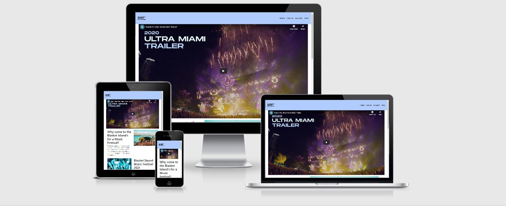
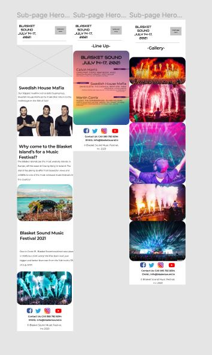
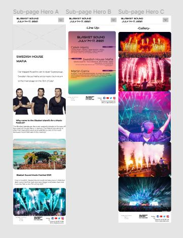
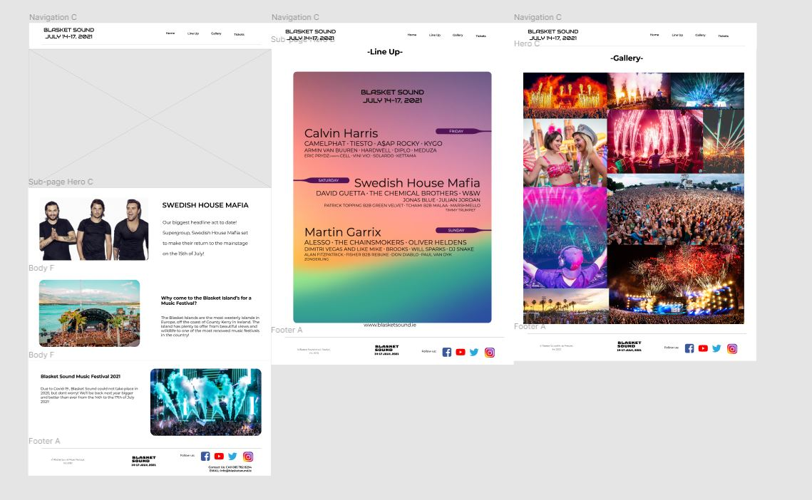
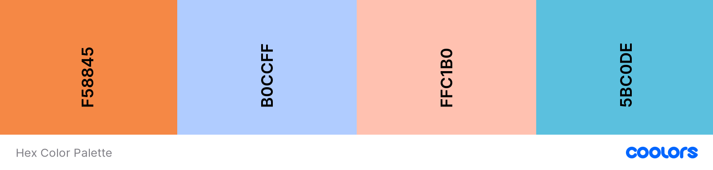

# Blasket Sound Music Festival

## **Code Institute - Milestone Project for User-Centric Frontend Developement**

Blasket Sound Music Festival is a fiction music festival based on the Blasket Islands off the coast of my hometown Dingle , County Kerry, Ireland. The idea came to me whilst 
I was reading through the Code Institute assessment handbook and saw that I had the opportunity to develop a website whichever way I wanted. Personally , I attend as much music
festivals as possible i.e Tomorrowland, Creamfields, Coachella etc. and I thought it would be great if I built and deployed a music festival website and fictionally made a music 
festival on the Blasket Islands as I thought people who have the same interest as I do would enjoy it and hopefully it would encourage them to do the same !

This project is the first of four Milestone Projects that make up the Full Stack Developer course at The Code Institute, the main requirements were to make a responsive and static website with a minimum 
of 3 pages using HTML5 and CSS3 , along with any other technologies you would like to use.

Click [here](https://jacksheehy15.github.io/milestone-project-1/info.html) to see the website live

# **Table Of Contents**
[Go to User Experience](#user-experience)
[Go to Design Process](#design-process)
[Go to Features](#features)
[Go to Technologies Used](#technologies-used)
[Go to Testing](#testing)
[Go to Deployment](#deployment)
[Go to Credits](#credits)
[Go to Acknowledgements](#acknowledgements)

# User Experience (UX)
This section gives an in-dept look into the UX design process, focusing on who the Blasket Sound Festival website is for and the main aims of the project in the eye of the user.

## Project Goals:
* To get people interested in music festivals and music festival websites.
* To learn about the music festival and the location of the festival.
* To be able to easily contact Blasket Sound with any enquiries/questions.
* To present information about the music festival and the artists that will be performing there.
* To create a website that is fullly responsive on mobiles/laptops tablets and desktops. 
* To make Blasket Sound appear as a reputable music festival by developing a professional website.

## User Stories

### New Users:
- I am a user that is new to the music festival scene, I would like to know why it is worth investing my time exploring the Blasket Sound website.
- I want to learn what is involved in a music festival on an island and what acts will be playing there.
- I want to attend this festival , but ticket prices arent released yet. I would like to contact the organisation to find out when I can buy tickets.

### Returning User:

- I am a returning user who has already visited the site and have already been in contact with the organisation, I would like to find out if any new artists have been announced for the festival.
- I also want to have a look at the gallery from previous years of the festival.

### Business Owner: 
- I am the owner of the business , I want to see the business succeed. I would like to clearly show off any impressive photos with our users to get their attention.

# **Design Process**

## **Strategy Plane:**
The main goal of the website is to attract users to be interested and enquire about the Blasket Sound festival. The website is aimed at a Festival lover to festival lover audience. 
It should include imagery related to the topic of the website. I started the UX process by thinking about what I would like to see on a music festival website and I started from there.

## **Scope Plane:**

The key features of the website were developed based on user needs. Users should be able to do the following on the website.

- Learn about the Island and where it is situated.
- Easily get in contact about any sort of questions they may have.
- Learn about the line up and the artist who may be playing at the festival.
- View images related to the festival, which essentially leads to a higher interest if the images are appealing to look at.
- A teaser trailer video related to EDM music festivals.
- Visit the organisations social media channels.
- Navigate easily throughout the website.

## **Skeleton Plane:**

This is when I started to develop my wireframes. I used Figma to create the wireframes for each page on desktop/laptop, tablet and mobile.

I aimed to make sure the main content were somewhat similar in design to create consistency, which I think was well executed.

I decided that the user would be greeted with a simple navigation bar with 4 choices - namely: **Home** - consists of information regarding the island and the teaser video, **Line Up** - consists of the festival 
lineup , along with a nice high quality photo on pyrotechnics at a festival with a header. **Gallery** - consists of a header and a full page of all different type of festival related photos. **Info** - consists of 
a contact form and an embedded google map of The Great Blasket Island.

Seen as there is alot of imagery on the Gallery page , I decided it would be ideal to put spacing between each picture which will prevent it from looking too busy.

After I was done with the wireframes I started writing my code. There is quite a difference between the appearance of the wireframes and the actual coded website.
The wireframes were extremely useful when I was coding because it essentially gave me a very accurate idea of where to put what.

The wireframes can be viewed on [Figma](https://www.figma.com/file/VKebMcOSMv7kaCPIMLpeu0/Blasket-Sound-Laptop)

Screenshots of my wireframes can be viewed below:

Mobile Wireframe

Tablet Wireframe 

 

Laptop / Desktop Wireframe 
 

### **Surface Plane:**

I next moved onto the design work of the website.

**Color Scheme** - Blasket Sound is a summer music festival so ideally I want bright, vibrant colors. The colors I chose are Mango Tango (#F58845), Baby Blue Eyes (#B0CCFF), Melon (#FFC1B0) and Sky Blue (#5BC0DE). 
You will see these colors across each different navigation bar on each page. Below is a picture of the color palette I got off the website [Coolors](https://coolors.co/)

**Typography**
I used Google Fonts to select the fonts for my project.
The Roboto font is the main font used throughout the whole website with Sans Serif as the fallback font in case for any reason the font isn't being imported into the site correctly. 
I also used the Anton font for the headings on the Gallery and Info page with Sans Serif as the fallback font aswell.

**Imagery**
Imagery is important. The large, hero video is designed to be striking and catch the user's attention. 
It also has a popular edm song playing in the background that will also grab the viewers attention.
I got the majority of the images off [Google Images](https://www.google.com/images)
I also designed my own logo for the website myself through [Free Logo Design](https://www.freelogodesign.org/)

**Layout**
I decided to use different background colors on the Navigation bar on each page to indicate what page the user is on.
I wanted the navigation bar color to match with whatever was on the page. I fixed the nav bar on each page also so it is easily accessible by the user if need be.
I decided to keep the background white on each page and the footer is also identical on each page.
To make the links and contact info stand out in the footer I decided to change the color of them to a Dark Blue color (#042f63)

# **Features** 
The project consists of 4 different pages which can be accessed through the menu in the navbar.

## **Consistent features across all pages:**
- The full Navigation menu shrinks down to a small menu with a hamburger dropdown menu when on smaller devices i.e phones,tablets etc.
- The fixed top navbar is consistent throughout the entire website.
- The menu at the top of the page and footer are consistent in design and responsiveness throughout, except for a different color on each different page of the site.
- The footer features a quote about the festival, useful links to navigate throughout the website and also includes an Address, Phone Number and Email Address which can all be clicked on to be availed of.

## **Home:** 
- The navigation bar is what the user first encounters on the Home page laptop/desktop or a navbar with a hamburger menu on tablets/mobiles.
- The user is greeted with a hero video related to a music festival that can be viewed in full screen and they soon understand the purpose for this webpage.
- The user then scrolls down to see images along with some text related to the Blasket Islands and the music festival itself.
- On smaller devices the Home page remains similar to the desktop/laptop version except for the navigation bar, which turns into a hamburger menu.
- The footer of the page contains social links, a quote related to the festival, navigation links for different pages of the website and a contact 
  section with linked items, there is also a copyright section at the bottom of the footer.

## **Line Up:**
- The navigation bar is what the user first encounters on the Lineup page laptop/desktop or a navbar with a hamburger menu on tablets/mobiles.
- There is then a hero image that is darkened with some white text which lets the text stand out to the viewer.
- Below the hero image is 3 bootstrap cards which house the date, times and artists names for the festival.
- The footer of the page contains social links, a quote related to the festival, navigation links for different pages of the website and a contact 
  section with linked items, there is also a copyright section at the bottom of the footer.

## **Gallery:**
- The navigation bar is what the user first encounters on the Gallery page on laptop/desktop or a navbar with a hamburger menu on tablets/mobiles.
- There is then a heading below the navbar menu which states that youre in the "Gallery" section.
- There are then 4 columns of images related to the music festival on laptop/desktop, 2 columns on tablets and 1 row on mobiles.
- The footer of the page contains social links, a quote related to the festival, navigation links for different pages of the website and a contact 
  section with linked items, there is also a copyright section at the bottom of the footer.

## **Info:**
- The navigation bar is what the user first encounters on the Info page on laptop/desktop or a navbar with a hamburger menu on tablets/mobiles.
- There is then a hero image that is darkened with some white text which lets the text stand out to the viewer.
- Under the text in the image is a button where the user can fill out a form to ask the organisation any question they desire.
- Below that is a header related to the embedded google map that I got from [Google Maps](https://www.google.com/maps/place/The+Blaskets/@52.0807839,-10.5674506,17z/data=!3m1!4b1!4m5!3m4!1s0x484fe78b664b9505:0x612d92860e39d164!8m2!3d52.0807806!4d-10.5652619)

> **_NOTE:_**  There is no 'scroll to top' button on my website seen as the pages are relatively small.

## **Features I could implement in the future:**
- An online booking/payment system to purchase tickets for the festival.
- A reviews section , possibly on the 'Info' page, where people give reviews on the festival.
- A newsletter page would be ideal for users to sign up to and increase the social aspect of the website.

# **Technologies Used**

### **Languages, libraries, frameworks, editors and version control** ##
- HTML5
    - The language used to create the form and add content to the website.
- CSS3
    - The language used to style the HTML5 elements.
- JavaScript
    - I used JavaScript for the Hamburger menu on smaller devices.
    jQuery:
- [Boostrap Framework](https://getbootstrap.com/)
    - I used Bootstraps grid system in order to have a 'mobile-first' approach.
- [Gitpod](https://gitpod.io)
    - I used Gitpods developement tools to write the code for the website.
- [Git Version Control](https://getbootstrap.com/)
    - I used Git for version control to record changes to my files.
- [Git Hub](https://github.com/)
    - I used GitHub's repository hosting service to host my deployed website as well as track previous versions of my code.

### **Other Tools Used**

- [Figma](https://figma.com/) 
    - I used Figma to design wireframes for my website for Laptop/Desktop, mobiles and tablets.
- [Google Images](https://google.com/images)
    - I used Google Images to get images for the Gallery side of my website and the hero images.
- [YouTube](https://youtube.com/)
    - I used YouTube's video service to get the hero video on the Home page of the website.
- [Google Fonts](https://fonts.google.com/)
    - I used the following fonts for the project: Roboto, Anton and Sans Serif fallback.
- [Free Logo Design](https://www.freelogodesign.org/)
    - i used this website to design the logo in each navbar of the website.
- [Font Awesome](https://fontawesome.com/)
    - Font Awesome provided me with the icons/logos used in the webpage.

### **Educational Resources Used:**
- [Stack Overflow](https://stackoverflow.com)
    - Stack Overflow was very helpful in regards to the JavaScript required for the hamburger menu.
- [W3 Schools](https://w3schools.com/)
    - W3 Schools was my main website that helped me the most in my project. From basic HTML5 all the way to complicated Bootstrap.

**_NOTE:_**  The Code Institute Slack community, along with the tutors were a big help during my project aswell.

# **Testing**

## **Testing User Stories:**
- New user - *I am new to music festivals and need to be convinced and explained as to why I should invest time into the website and festival* - 
on the homepage, the user is met with a top-stuck navigation menu, containing **Home**, **Line Up**, **Gallery** and **Info**.
There is then a festival trailer which teases what a music festival is like to the new user.
There is then images and text related to the festival and the island explaining some basic information about the festival and the island.
The footer at the bottom of the page consists of 4 sections- the **Festival Quote**, **Useful Links**, **Contact Info** and **Copyright Info**
The gallery would be the main point of interest for the user , as there is alot of tempting images to be found there.

- New User - *I am somewhat familiar with festivals , but I want to see what this festival has to offer.* The user can easily navigate to the line up page to see the artists
that are playing at the festival. The new user can also get in contact with us by navigating to the **Info** page and then pressing the **Contact Us** button and the user will
be prompted to fill out a form in which they can ask any question they want.

Returning user - *I want to ask a question related to the festival , because it is possible I will attend* - The user can easlily navigate to the **Info** page where 
they can submit a form with their quesion - or else , the user can navigate to the bootom of the page to the footer and they can click on the phone number and it will lead to their Phone application
if they are on mobile for the user to call us. The user can also click on the email address at the bottom of the footer and it will take the user to their email application where they can send 
us an email.

Business owner - *As the business owner I want to see a consistent style throughout the whole webpage* - The business owner can navigate throughout the website and they will notice that the navbars are the 
design, except for different colors on each page. The footers are consistent across all 4 pages. The header font used is consistent across the site and the font used is consistent for all paragraphs.

## **Validating The Code:**
- **HTML** I validated the HTML with the [W3C Markup Validation Service](https://validator.w3.org/)
- **CSS** I validated the CSS with the [W3C CSS Validation Service](https://jigsaw.w3.org/css-validator/)

### **Validation Results**
#### **HTML**
- Home Page - No Errors Found
- Line Up Page - No Errors Found
- Gallery Page - No Errors Found
- Info Page - No Errors Found

#### **CSS**
- No Errors Found

## **Testing on Different Browsers**
I manually tested the website on the following browsers:
- Chrome
- Safari
- Mozilla Firefox
- Samsung Internet

## **Testing responsiveness on multiple devices and screen size:**
I manually tested the website using Chrome Developer Tools to check every single page, link etc. on as much different devices as possible.
The devices I tested this on were: Moto G4 , Galaxy S5 , Pixel 2 and Pixel 2 XL, iPhone 6/7/8, iPhone 6/7/8Plus, iPhone X, iPad.
I also tested my website on my own persoanl devices: MacBook Pro 16", my desktop pc with a 21" monitor, Samsung Galaxy S20 Ultra and a Samsung Galaxy Tab S7.

## **Issues Found**
- When devoloping the Gallery page of the website I noticed that on the iPad and iPad Pro the images would cram together and it would look completely out of the ordinary. 
I resolved this issue by using the Chrome Developer Tools and changed the layout for images in the gallery on different devices. For dektop/laptop there are 4 rows of images. 
On tablets under 1024 pixels wide and above 600 pixels, there are 2 rows of images. On mobile devices there is 1 row of a certain amount of images.

- Once I had finished the layout of my website I was really happy with it. My mentor had noticed that my navbar wasnt stuck to the top of the page so she told me to change it. 
That was a slight issue I had to resolve. Thanks to
a few extra lines of code and help from the Slack channel, I got the navbar to stick to the top of the page at all times.

- On tablets , the gallery had a little white spacing between the right column and the right side of the screen, I used Chrome Developer Tools to find out what was causing that and I found out there
was a right margin of 15px so I went into CSS and fixed that and the gallery looked perfect.

- The biggest issue I encountered during my project was Bootstrap. I'm not quite sure why , but I found Bootstrap extremely hard to understand. It took me about 2 weeks into my project to properly
understand Bootstrap in all its glory. Now that I am familiar with Bootstrap I feel alot more confident.

# **Deployment**
This project was developed in GitPod and deployed to the hosting platform [GitHub Pages](https://www.google.com/images)

I took the following steps to deploy Blasket Sound 2021 to Github pages.
- Searched GiHub in Chrome browser and signed in using my GitHub account.
- Clicked on [My Repositories.](https://github.com/jacksheehy15?tab=repositories)
- Navigated to [milestone-project-1.](https://github.com/jacksheehy15/milestone-project-1)
- Selected [Settings.](https://github.com/jacksheehy15/milestone-project-1/settings)
- Scrolles down to the GitHub Pages are of the page.
- Selected 'Master Branch' from the 'source' dropdown menu.
- Confirmed my selection.
- Blasket Sound 2021 is now live on [GitHub Pages.](https://www.google.com/images)

### To deploy your own version of thwe website
- Have git installed.
- Visit the [Repo.](https://github.com/jacksheehy15/milestone-project-1)
- Click 'Clone or Download' and copy the code for http.
- Open your chosen IDE (Cloud9, Vs Code etc.)
- Open a terminal for your root directory.
- Type 'git clone' followed by the code taken from the repository.
- When you have completed all these steps, you have your own version of the website !

The website can be run by opening one of the HTML files within a web browser.

Visit the link provided. Your website with any made changes will appear.

Saved changes to the website will appear here after refreshing the page.

The benefits of hosting your website on GitHub pages is that any pushed changes to your project will automatically update the website. Development branches can be created and merged to the master when complete. It may take a moment for changes to appear on the hosted website.

# **Credits**

## **Content**

The content on this website is mostly fictional regarding the festival being held on an island. all the images are taken from the internet, I will reference them all below.

I found the website [Lollapalooza.com](https://www.lollapalooza.com/) and [Tomorrowland.com](https://www.tomorrowland.com/) really useful when I was looking for what kind of content I need to have.

A massive thank you to my mentor Seun Owonikoko for suggesting that I look through the following README.md file by a fellow Code Institute student Chloe.
- [Chloe's README.md file](https://github.com/chloelewisdev/milestone-project-1/blob/master/README.md#User-Experience)

- I got the code for the Contact Form [Here](https://mdbootstrap.com/docs/jquery/modals/forms/) 

- I formatted my HTML code using [Free Online HTML Formatter](https://www.freeformatter.com/html-formatter.html) 

- I formatted my HTML code using [Free Online CSS Beautifier](https://www.freeformatter.com/css-beautifier.html) 

## **Media** 
The images/video on this website were taken online, a full list of the links can be found below.
- [The hero image on the info page.](https://www.google.com/search?q=sweish+house+maifa+fire&tbm=isch&ved=2ahUKEwjUy_PF4-3rAhVKEsAKHa-DD4EQ2-cCegQIABAA&oq=sweish+house+maifa+fire&gs_lcp=CgNpbWcQA1CII1j4J2DnKmgAcAB4AIABMogB6gGSAQE1mAEAoAEBqgELZ3dzLXdpei1pbWfAAQE&sclient=img&ei=oBJiX9T7K8qkgAavh76ICA&bih=1036&biw=1920)
- [The 2 images on the home page](https://www.google.com/search?q=hideout+festival&tbm=isch&ved=2ahUKEwiuoIXJ4-3rAhUJNMAKHZSCDNIQ2-cCegQIABAA&oq=hideout+festival&gs_lcp=CgNpbWcQAzIECCMQJzIECCMQJzICCAAyAggAMgIIADICCAAyAggAMgIIADICCAAyAggAOgUIABCxAzoICAAQsQMQgwE6BAgAEEM6BwgAELEDEENQqskGWKTlBmDV5gZoAHAAeACAAVWIAYcIkgECMTaYAQCgAQGqAQtnd3Mtd2l6LWltZ8ABAQ&sclient=img&ei=pxJiX-6wEonogAaUhbKQDQ&bih=1036&biw=1920)
- [The Video from the home page.](https://www.youtube.com/watch?v=fz8VM-jnXds)
- [Line Up page hero](https://images.app.goo.gl/HHYk6CHNxU5znxXv5)
- [Gallery picture 1](https://www.google.com/search?tbs=sbi:AMhZZiuXckeFBzEaALQ6uftvbDqW7LUddyBF330nXkW7r_1cn98hrqO6XlOtH5GTLsSgCnlE_1iSqLZuiJSt4pIy60xQ5dMlatp_1Nkyaqa6eF6uD9xhfbLzM0wajm9wFuWpDv7FRErGijcAgBWZj3izRe2w7KXM6ua4wYuhTGdSGx7X4ZHtN1T4xbDHM9UkTRNEMARtuUoyVn5u8V30-7H7r_10B79Ug-pmVqO1PmaHZb2Bw_1lmIezJpQaYljq_1Yp-ADM7RuDRn5U-11B3fPyGVcuTBA0qzooLHUrcx0i23RXJLySmdsvZULVV7lLKy-pG5sJHFl8cIh4-kvxaTInhs-5XVQuqVC6cl9w)
- [Gallery picture 2](https://www.google.com/search?tbs=sbi:AMhZZitG_1-NYmDDBYqv_1pLayMiVP8dv-gNR4MDIq38YmfN1aSeccrmi3eZT-iOZsqjEjw1GFz4WHb8OIkWD7DMOY6pl6CpZOAUTvEvuLe_1Z766fQFn2jjpGuYVIn5duCgQVl2xQR_1vBPXpp-VQ7j6-rWNaZQiDNpFc2sFnQiM0ZguMi3Wm6IZZGp8MEg0IMLjVOye8z_1IEa9OqDJY98BP17pbuW0zEUE981VaJqZ7R5HX4ACBok8d67MH_120o4GdztmZxLzxkip-kYXaoxg4THQMED0LLqoW_14N3jgsB6y9me4dy-xKwOyHHSoPcPi4Cdl5DYWJNOQBnpHpwIUhQk6-nTPwEyWuMRw)
- [Gallery picture 3](https://www.google.com/search?tbs=sbi:AMhZZiuUmvznufkbIM9Fhtn2aB4bj3T8cBZjvshNnCoCPDETfGcGi_1e_1Y9j1ymZ-7Wb1HiC11W77Xacl6DykkdBFHl2rL10URHL1cj-_1BM5L7FNHFAKEZX3s_14ktEfFWMEbCj7tJ0KNQo3vzeRSkmOu0vfH4mMkj0ylsLiXhJt4hN9vn4gP9CYyQ9QtFttOce18RAl_1RfYdUPjBROllll2TWpodCybM5EUWNf4hDDF-7gBftQya3AUaXX7-Y3DvttuSK99ZFod-2fhyR1gEWsuILBaWLXVkcn2xk-DMBo7O5l-bguQQGRElOY0x6OXPobK--M55yee5857Gt5_13z-UVVBWpmnIB9cw)
- [Gallery picture 4](https://www.google.com/search?tbs=sbi:AMhZZisv9F0yMnljZ-BpDFMfPKXkLrM-d5l4CdPJTeCGB6XHZEqYnbDWXZ7PwLVCvnYr0v9DyYUtA2LuU8HV4bgFs0B2IK8qlZP0cTUUkVBWqgntEjYnolVyNsvBifCs2ChHdS0aeM5NdEoOGTny0MhZzlhmrVXff68T8HMbNbhENHB1ngZDHlR0dSjsBAaklG1tgE3k4zUwxaDZLOeEWyzgLSF7V886E1IH48HSKWYwMXV0ot891bwd9pAO9G3bwxtxMjBSh_1kOVgd0-hl7DU-ZrSuO9WN5n_16YHfL6o5szp_1QwYJ_1XXo7I6pDLhjjbf-OVqSe7lsREGnurYZNzlsfqtDtXk0oMPw)
- [Gallery picture 5](https://www.google.com/search?tbs=sbi:AMhZZiv5BfV963nD4F6F1ZWaHpQ4vWcS-MUg4O6bfVhj7O4ZHYYQMc2IlWFCDDaxsKz0tswU3Bzg0A0z2M6hrB39JB2NibtzkEuIdAjzDJ6t2XDZKguEGCUxxtAb0jonzHTMFtD60l8kx5D2gZnx7pHFULPdd6TIidPJKU48ZlvQEyRLff7hZmOmfccMD9DIBZ-CoEIF7JlinRLANRtuIzad_1vd6LOAfZ8yj9x_1VEDhhPqyrxsPwg4O-s3kMRTPRKOcGZt2rJPcQCaN85UerE9ZzJ35fNpBqJxQEfFErbIxPY8jgox0FpEwitaA0IFm8hkfSeoctAFqPTxRKoBBhoJRhi6-yCJAL4Q)
- [Gallery picture 6](https://www.google.com/search?tbs=sbi:AMhZZiuMv_1fvTTGP0-aQx_1p6Xv-OpDYi5XPdYTSIrRIBr9HPHO18hqv5yCkXeJ-InitycWVjsyBht1TUfo2IsBxh0SaF6p0oU7rRjtEtYCJPpMq0jRTOKNvTkiBeZ-SDmouIPkcj9Gyhv-2FvGJDH1j0eXVxBWtqkAJNRbiJ4oZzCIYXEQnOgJj3KAgWYkPHnR44gBg2enT_1Kzd6fQN8JDVep1E5myA9aHiUKB5bL52JMVjcIlayowVUPQ2vE_1mvZH0bE1I4H0BDMqwUCFhwn4hmmYwxClx0cGLhm-jwrXarPj5UCj2Wa2kW2CtYZ80K_1iBqLd5TBUrXoIjmw8CgghgzMzoYkzgfkA)
- [Gallery picture 6](https://www.google.com/search?tbs=sbi:AMhZZiuMv_1fvTTGP0-aQx_1p6Xv-OpDYi5XPdYTSIrRIBr9HPHO18hqv5yCkXeJ-InitycWVjsyBht1TUfo2IsBxh0SaF6p0oU7rRjtEtYCJPpMq0jRTOKNvTkiBeZ-SDmouIPkcj9Gyhv-2FvGJDH1j0eXVxBWtqkAJNRbiJ4oZzCIYXEQnOgJj3KAgWYkPHnR44gBg2enT_1Kzd6fQN8JDVep1E5myA9aHiUKB5bL52JMVjcIlayowVUPQ2vE_1mvZH0bE1I4H0BDMqwUCFhwn4hmmYwxClx0cGLhm-jwrXarPj5UCj2Wa2kW2CtYZ80K_1iBqLd5TBUrXoIjmw8CgghgzMzoYkzgfkA)
- [Gallery picture 7](https://www.google.com/search?tbs=sbi:AMhZZivk1d45o9ynd2wMIIVMV5_1rTaEQ6KLTODk_1xLuRDZuVP2NW0NyA7TcELWd0LlJjQi6bkB2kg0YfCOTYpyGoeSyR_1ZtS_10QWd5OYHIElldVtnoRy3gjyZoS9I5VqKKrNddevO9n3OQZjfl6KID_1racHBfkJjcZ_1mX3g70gJmMhNRAuyBiWnFYQs4un5PeFCcaqVZ5imHu4iJ4ikkxU1FymphJDHQFDAdUZBTi7Ct88xTVk15NYogKA-VhbFQ2B53-r_1pPb7O7p5n3JY3pwqLm8E3h_1zfumSFdgTVKG8Bi-gRrs_1EUX1Mj65SpWuJRIvBSozgHcf6T5k1iaW2uhmrEzShfeardA)
- [Gallery picture 8](https://www.google.com/search?tbs=sbi:AMhZZitQir1dewxtcs0nd2mM3QKUh_19ZYbhm2130Ud8jPpFVNDbJsuCp23gLORTZgrcW2jlbTkSYKzZqRa5r2x6csBBDinM40Hwdbw1nprzxjSIXO7N154GQVt1FztLuUukl-0f90ryx9mbHge3yQdsYPSjy3k0QxlX7soG7It7ybIYvx7nkDShJAo1V939sawrUZcZoQ5fE31vsJFkef2Efm5cVEdV7F60wNsOnfLis0Gjyog7O3fvVDAkCMPU_1UfFkKRXn2_1KbcZFhQmcjQdeIQP8PYNFArGsOVb8_15p5Mk-PxJXPOM5KFtSw-Kf4aahS68W_1P0S5ICDm4cSZg4qoj0VGdrddORw)
- [Gallery picture 9](https://www.google.com/search?tbs=sbi:AMhZZivW3HM9kQ89VlGmnlgAxQ-CmBL1Ndb8kQYyjIYgblmB8SgonIIYi4u-KixXmtlgycWPHsgnqDnw68uWvZrGRc-O_1eZg092Fgjo5v-gTvQSb9RhcW1jqNkITW1ei-TW6cn_1O5HnsUDh58p5sviut7FWCM1ho6gRgX_1gEryvK5bTfsHrsE24hcD8CV17J_1RKXhQfufPyABDAdtU4KQP6ERbZu_1Jua8gfugW8QZ9N3p8U3Xy_1wMWErk4TBZTUtdSEjN0NWYIzLAK392ILmaKxkYPZNDL3MJeJGwgh9geNrFWBVK6Ea7PmlddamH1CWWY9nZdO6DL5zePB9H7iD0FPSZXt2I59h1g)
- [Gallery picture 10](https://www.google.com/search?tbs=sbi:AMhZZit4nXKoUpzCnzOfhgOJZb6P_13uWzwf4stWYGVs4MNIyVWmUuud0UsAlk7g7xTM9D3Uaxe59qWCQ0Gb6y1_1LAOdt29RcZBCdzso3sht20_1YWciWd74_1YoRablQWX4fapvVt4c_1M-Sl0ZZUmqUSABtm_1ZrUKw_12fQAYbQTP0VlXVO-D4lekkv-pzsx3fWhJoxw5ab7myofcYSj1D-vsBETX3imR4WvaqMLJxG7kuEAe8xtKzx5KQiqcQyG201nnhEG5cKWqCCVmcv-QGuylGLbMqlD-9DUBxGgyUd2KzXuPd1JeSdYm7q4ch0xKi00_10kUwVs7DTWfb3QGpYUlGZYFdcT5A4n7w)
- [Gallery picture 11](https://www.google.com/search?tbs=sbi:AMhZZit4kUew3gi1NL9oWiKfRyYGPe4GIpEpmrecMCBjEE1PBA3Gc-8_1PcKJAf9aQuCS7yvuX1s0yMhWTNx9jEzKy3hY86MMP-ShgkVT6Ch8eAhon6ciS83USGz4wBP6ivkNdXdNvh8i0k0_1kJVaudjer0gsCA1xglAn9N2inOa1Jv56iqtGVSSf_15-sv62zPnb7xN3-1CAKfVC4Q_1BKaGnoHiT95qQJAAkp9pNLicGQi_1vGBegMzkVgTNtUHtIczHuqAtU0q68cA9neE1RaSCyqVTzCWVU43YD2jspl4NfRX_1bhoLutv8z9pnRYBb4bmObArg3Btn4B9b3fHNL7sfI7SlrpRO7yWg)
- [Gallery picture 12](https://www.google.com/search?tbs=sbi:AMhZZiteDAYFjV-saORo1Tuvjm467NxscpXW-vKa7JhODqGlVEcK6gokk_1PjI_1rXcP93kfAltOkpazXoWgAWYjn9nDfHBriHzXCuO7y51fo_1BZx7GkGEEEc1PPdAjDYmpy_1nLMxSwb6He-g0Gw0gyWwRoWUNk3VmzVfeKeizlTpLmxKvw9Rzv1QGifurimrxLGZgXyTlowRs0cS6ap7sD3LIV84PACa6pBN4dEaQQbMfvaOpDg7WkJrdrJGEmLYIeE71UyadgD4cxAXfT4wNY8iqYFJGJRdYsqf8kyJRuIZLXILDtQfgy7521mx4796lhh9JPqvFX3gZ9P_1UFUDKPAYtSFK0TU3a8w)
- [Gallery picture 13](https://www.google.com/search?tbs=sbi:AMhZZiu0Lq91g4zha38kQoSVQ0zW_1YC-fwvTDvFp0XQzW4TUfRV_1ic1RBVwsG3iIajo_1ACsd6ab1gaxI7AtXrbUuqIgHoK1WX3dklqDvrxoYTQNkhzHDUdiuy0CcLVX3QeGcign0lV_1V2FdY1-0hx25aZ08MGPJxi0uQqwvPxgQJg8aUrUjr0ygS3uCnxXvIahzc4FU19c_1aYmK-FFWG2Q-ULqCbX0hS1K6n1YNmYoUqQmQ5TuF9ZSNxP3DMDe3l1FCdQ4nBolYgz13gcufjGy7Zba0Osz0KL7OhRlo5vq_1OrtlNssG8p3LPk_1mKfygZkyTkQDW4QxVLyol7vcvXLQKQ1AV1arfIqw)
- [Gallery picture 14](https://www.google.com/search?tbs=sbi:AMhZZivJxBItp-20EIVDwei7_1uhZVLaGH2sk1ho6jrFomDd_1gKrvTb0CTziubEVH9JaSl8whpHmPo85wqaj6ZgHah9CpN8SVBfiUVyrGLuF3aUqOKbmhB-uH51Vta4z_1Ed7Tm2ZVxwODqTizVwjvSr3tiPg9RqS2PuDoGc-FVpeK1PmOuNgMBYbryGsSMUPBZhxNeNZDXcL-j5T4mVk8ddL65ht6RRelZ2mf7riLrlBfXe2AQkfWk6_1NIDVLwvcXqXG_1hIRLtu8LJX0JXtSIVnwM3roZnZzf_1daH31DhR7oD7DFNpZaDMzUy-5xJhpZ8d_1sV5oQRxSihJbRaimQmaT8VG-wPoU5UOA)
- [Gallery picture 15](https://www.google.com/search?tbs=sbi:AMhZZivU2QYquRikpz3VLkGq8G1LB8eK0cR8WUzZoS2A8vMsDDKPWzdPfQ7GxRmbVkIfC1ubKqNtzwwezZWO5d0qXMfiDJuXAobM7s_1SDgDcFR3msrMpwcmFBSkHZk_1Wwmd4wefa5C4QJCIJcQyDrZwqX7hH0UOG0zZcBHL3fhHItct6Rhr2gAn5W8paw0Nwmt662GfmvxeQZCqTQVLSpw0UJCIbRxqVO2OwLJsdIWBlp2FQsjQISvTvfUi_1VuR8wU39pnEZYZi4vDIpiSNcYtZ5i3mCyOa-NDc9ROD9Ki8lCVC_1IRqhx05wJqvrpVE_1fmkfmuhTCUkpcghRzZ8n_1kf2zuAyBW5rWA)

# **Acknowledgments**

Thanks to The Code Institute slack community.

Thanks to my brother and father who looked over the website on their mobile phones and made sure everything looked good.

Thank you to 2 fellow Code Institute slack members, Bim Williams for helping me understand Bootstrap further, and thank you to Bartek Makowski for giving me great feedback on my wireframes.

A massive thank you to my mentor Seun Owonikoko for her knowlege, time and help when I needed it the most.

